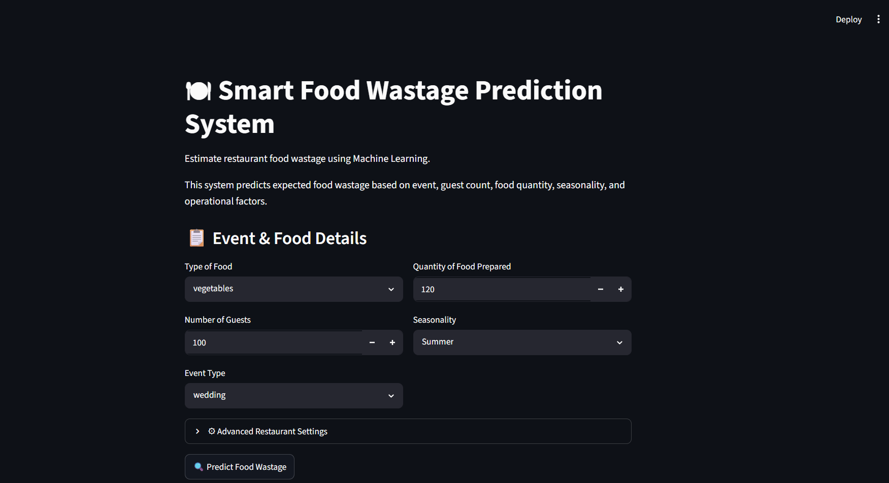
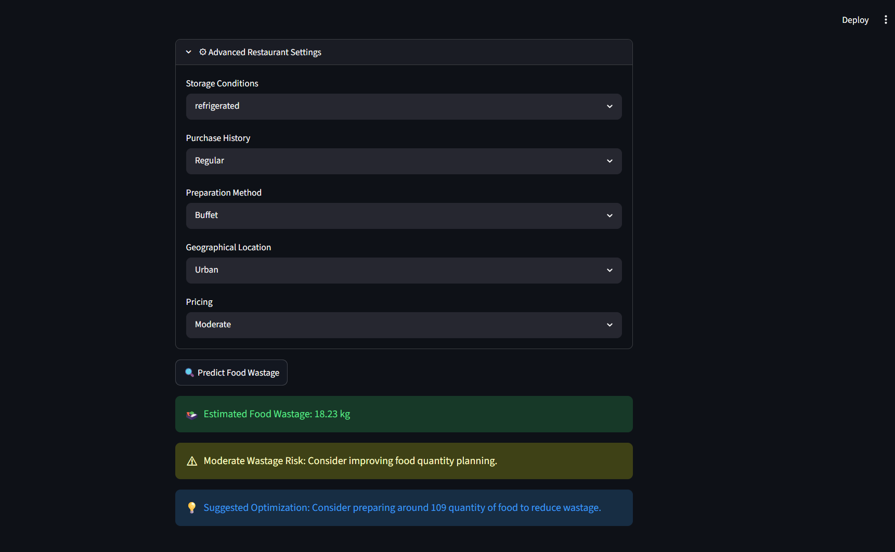

# 🍽 Smart Food Wastage Prediction System

<p align="center">
  
</p>

<p align="center">
  
  
  
  
</p>

<p align="center">
  <a href="https://smart-food-wastage-prediction.streamlit.app/">
    
  </a>
  <a href="https://github.com/Akash-0012/Smart-Food-Wastage-Prediction">
    
  </a>
</p>

---

## 📌 Project Overview

Food wastage is a major challenge in the hospitality industry. This project uses **Machine Learning** to predict the expected amount of food waste based on restaurant and event-related information. The system helps restaurants improve food planning, reduce waste, and optimize operational decisions.

---

## ✨ Features

* Predicts expected food wastage
* Interactive Streamlit web application
* Random Forest regression model
* Food wastage risk assessment
* Smart food quantity recommendation
* User-friendly interface
* Live online deployment

---

## 🛠 Technology Stack

* Python
* Pandas
* NumPy
* Scikit-learn
* Streamlit
* Matplotlib
* Seaborn
* Joblib

---

## 📷 Application Preview

### 🏠 Home Page



### 📊 Prediction Result



---

## 📂 Project Structure

```text
Smart-Food-Wastage-Prediction
│
├── App
│   └── app.py
│
├── Dataset
│   └── food_wastage_dataset.csv
│
├── Images
│   ├── project_banner.png
│   ├── home_page.png
│   ├── prediction_result.png
│   ├── feature_importance.png
│   ├── model_comparison.png
│   └── correlation_heatmap.png
│
├── Model
│   ├── food_wastage_model.pkl
│   ├── label_encoders.pkl
│   └── scaler.pkl
│
├── Notebook
│   ├── 01_data_Preprocessing.ipynb
│   ├── 02_EDA_Insights.ipynb
│   └── 03_food_wastage_model_building.ipynb
│
├── README.md
└── requirements.txt
```

---

## 🤖 Machine Learning Model

The project compares multiple regression algorithms and selects the best-performing model.

| Model             | R² Score   |
| ----------------- | ---------- |
| Linear Regression | 0.55       |
| Decision Tree     | 0.72       |
| **Random Forest** | **0.84** ✅ |

**Final Model:** Random Forest Regressor

---

## 🚀 Run Locally

```bash
git clone https://github.com/Akash-0012/Smart-Food-Wastage-Prediction.git

cd Smart-Food-Wastage-Prediction

pip install -r requirements.txt

streamlit run App/app.py
```

---

## 🌐 Live Demo

**Try the application here:**

https://smart-food-wastage-prediction.streamlit.app/

---

## 👨‍💻 Author

**Akash**

Machine Learning | Data Science | Python

GitHub: https://github.com/Akash-0012

---

## ⭐ If you found this project useful, consider giving it a star!
