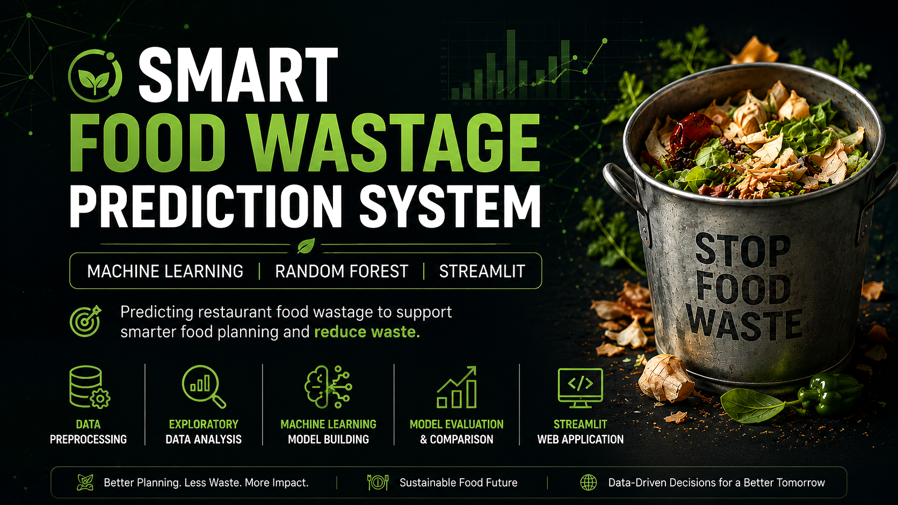

<p align="center">
  
</p>

<p align="center">
  
  
  
  
</p>

# 🍽️ Smart Food Wastage Prediction System

An end-to-end Machine Learning project that predicts restaurant food wastage using historical operational data. The system helps restaurants estimate potential food waste based on event details, food quantity, guest count, and other operational factors, enabling better food planning and reducing unnecessary wastage.

---

## 🚀 Project Overview

Food wastage is one of the major challenges faced by the food service industry. Over-preparation, inaccurate demand estimation, and inefficient planning contribute to significant financial losses and environmental impact.

This project applies Machine Learning techniques to predict the expected amount of food wastage using restaurant operational data. A Streamlit web application was developed to provide real-time predictions through an interactive user interface.

---

## ✨ Features

- 📊 Data Preprocessing and Cleaning
- 📈 Exploratory Data Analysis (EDA)
- 🤖 Multiple Machine Learning Models
- 🌲 Random Forest Regressor (Best Performing Model)
- 📉 Food Wastage Prediction
- 💻 Interactive Streamlit Web Application
- 📦 Model Serialization using Joblib

---

## 🛠️ Technologies Used

- Python
- Pandas
- NumPy
- Scikit-learn
- Matplotlib
- Seaborn
- Streamlit
- Joblib

---

## 📂 Project Structure

```

Smart-Food-Wastage-Prediction/

├── App/
│ └── app.py

├── Dataset/
│ └── food_wastage.csv

├── Images/

├── Model/
│ ├── food_wastage_model.pkl
│ ├── encoders.pkl
│ └── scaler.pkl

├── Notebook/
│ ├── 01_Data_Preprocessing.ipynb
│ ├── 02_EDA.ipynb
│ └── 03_Model_Building.ipynb

├── Report/

├── README.md
├── requirements.txt
└── .gitignore

```

---

## 📊 Machine Learning Models

The following regression algorithms were implemented and evaluated:

- Linear Regression
- Decision Tree Regressor
- Random Forest Regressor

Random Forest achieved the best overall performance and was selected as the final prediction model.

---

## 📈 Model Performance

| Model | R² Score | MAE | RMSE |
|--------|---------|------|------|
| Linear Regression | 0.547 | 5.28 | 6.68 |
| Decision Tree | 0.724 | 2.65 | 5.22 |
| **Random Forest** | **0.838** | **2.40** | **3.99** |

---

## ▶️ Run the Project

```bash
pip install -r requirements.txt
```

```bash
streamlit run app.py
```

---

## 🎯 Future Improvements

- Improve prediction accuracy using larger real-world datasets.
- Integrate weather and attendance data.
- Deploy the application to Streamlit Community Cloud.
- Explain model predictions using SHAP values.

---

## 👨‍💻 Author

**Akash Singh**

MCA Student | Data Science & Machine Learning Enthusiast
